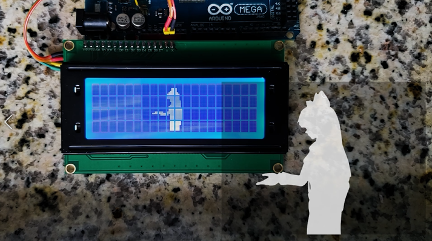

# PyToArduinoVideo
## Python to Arduino video converter

----------

This project allows you to run video from a computer on a 20x4 LCD display with an HD44780 controller.

The original video is captured by OpenCV (Python), divided into blocks of pixels and sent to the serial port. Each character = 40 bits. Arduino takes 8 characters (one line) and writes them to the display memory. As soon as a new line arrives, the screen is cleared.

The project has no real meaning and is made just for fun :)

----------

## Feedback
- Developer: Fern H.
- E-Mail: xxoinvizionxx@gmail.com
- GitHub: https://github.com/XxOinvizioNxX
- Twitter: https://twitter.com/fern_hertz
